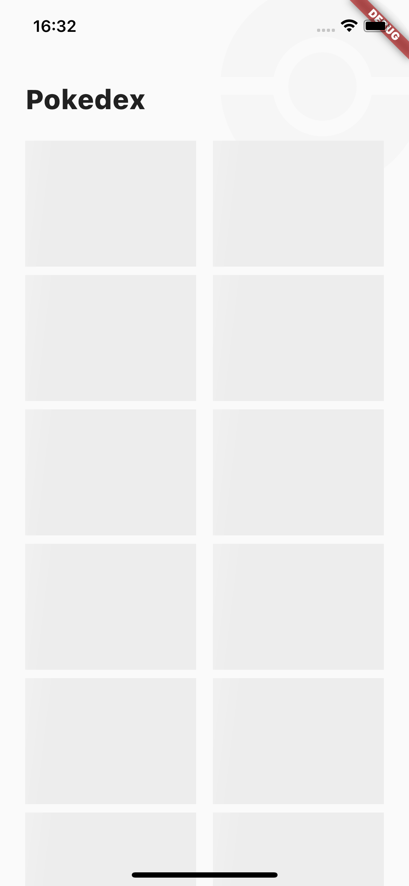
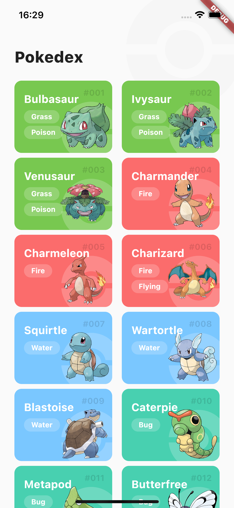
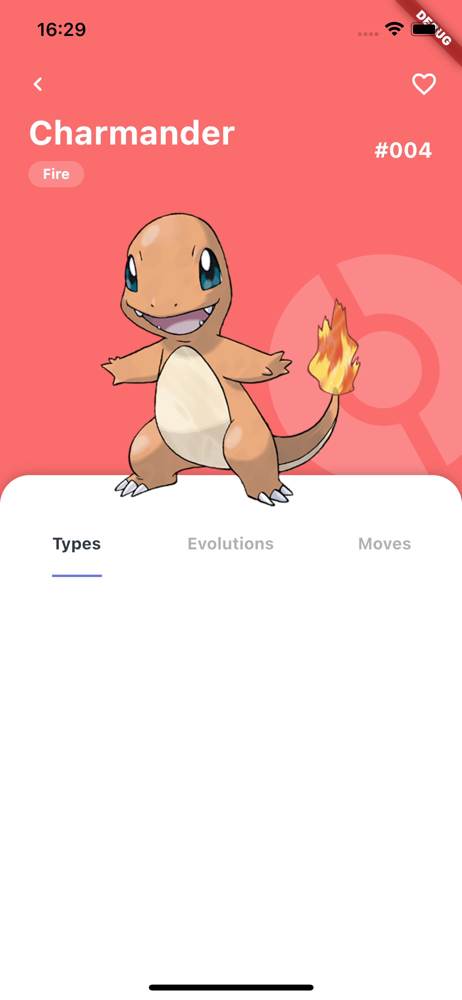

# Pokedex

Projeto em flutter de App para simular uma pokedex que consome a api [PokeApi](https://pokeapi.co/) para retirar as informações dos Pokemons. Baseado [neste design](https://dribbble.com/shots/6540871-Pokedex-App) retirado do dribbble

## Como executar o projeto

Para começar, verifique a integridade da sua instalação do flutter
    
    flutter doctor

clone o projeto e vá para o diretório dele

    git clone https://github.com/matheustimbo/FlutterPokedex
    cd FlutterPokedex
    
então, baixe as dependências do projeto, gere os arquivos de mobx com o build_runner e execute em modo debug

    flutter pub get
    flutter pub run build_runner build --delete-conflicting-outputs
    flutter run

## Arquitetura

Nesse projeto, segui a arquitetura do flutter modular, separando a estrutura do projeto em módulos e uma pasta core ou shared onde ficam arquivos importantes para mais de um módulo.

## Bibliotecas utilizadas

- [flutter_modular](https://pub.dev/packages/flutter_modular) Estrutura de navegação, injeção de dependências 
- [dio](https://pub.dev/packages/dio) Cliente HTTP
- [mobx](https://pub.dev/packages/mobx) Gerenciamento de estado
- [flutter_mobx](flutter_mobx) Widget Observer para ouvir observables e reconstruir o componente filho quando houver mudanças
- [build_runner](https://pub.dev/packages/build_runner) Gera código dart dos arquivos mobx
- [shimmer](https://pub.dev/packages/shimmer) Animação Shimmer para carregamentos dos cards
- [cached_network_image](https://pub.dev/packages/cached_network_image) Cache de imagens
- [sliding_up_panel](https://pub.dev/packages/sliding_up_panel) Painel/Card que muda sua altura máxima pelo gesto de slide entre uma altura mínima e máxima

## Telas do aplicativo

Lista de pokemons

  
  

Detalhes do pokemon

  

